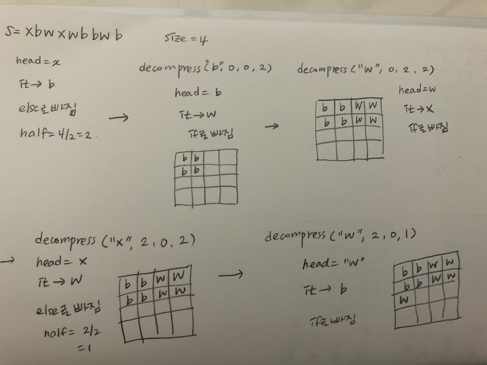

# 7. 1 도입

분할정복이란? 주어진 문제를 둘 이상의 부분 문제로 나눈 뒤 각 문제에 대한 답을 재귀 호출을 이용해 계산하고, 각 부분 문제의 답으로부터 전체 문제의 답을 계산해 내는 알고리즘

6장과 다른 점은 문제를 한 조각과 나머지 전체가 아니라 거의 같은 크기의 부분 문제로 나누는 것

구성요소
문제를 더 작은 문제로 분할하는 과정(divide)
각 문제에 대해 구한 답을 원래 문제에 대한 답으로 병합하는 과정(merge)
더 이상 답을 분할하지 않고 곧장 풀 수 있는 매우 작은 문제(base case)

분할정복의 장점이란? 같은 작업을 더 빠르게 해 준다.
빠름을 보여주는 예로 수열의 합과 행렬의 빠른 제곱

recursiveSum은 N번의 함수호출
fastSum은 N이 절반으로..

행렬까지 생각하면 빡세니..일단 거듭제곱으로 생각해보십다.

A^m = A^(m/2) * A^(m/2)

홀수를 절반으로 나누는 경우와 1을 빼서 짝수로 만드는 경우
-> 같은 값을 중복으로 계산하는 일이 많기 때문에 m이 증가함에 따라 pow()의 호출횟수는 m에 대해 선형적으로 증가합니다. 

-> (a)의 pow(A, 4)는 모두 3번 호출됩니다.

병합 정렬과 퀵 정렬
-> 두 알고리즘 모두 분할 정복 패러다임을 기반으로 만들어진 것
병합은 각 수열의 크기가 1이 될 때까지 절반씩 쪼개 나간 뒤 정렬된 부분 배열들을 합쳐 나감
퀵은 맨 처음에 있는 수를 기준(=pivot)으로 삼고 작은 수를 왼쪽으로, 큰 것을 오른쪽으로 가게끔 함

카라츠바의 빠른 곱셈 알고리즘
코드 7.3을 그림으로 그려보면 아래와 같습니다.
시간 복잡도는 for문 2번이니 O(n^2)

카라츠바의 빠른 곱셈 알고리즘은 두 수를 각각 절반으로 쪼갭니다.
a와 b가 각각 256자리의 수라면
a = a1 * 10^128 + a0
b = b1 * 10^128 + b0

a1, b1은 첫 128자리, a0, b0는 128자리부터 나머지
잘 계산을 해보면 곱셈을 4번에서 3번으로 줄일 수 있다. 

# 7. 2 쿼드 트리 뒤집기

문제) 쿼드 트리로 압축된 흑백 그림이 주어졌을 때, 이 그림을 상하로 뒤집은 그림을 쿼드 트리 압축해서 출력하는 프로그램을 작성하세요.
2^N x 2^N 크기의 흑백 그림을 문자열로 변환

-> 픽셀이 검은색이면 B
-> 픽셀이 흰 색이면 w
-> 모든 픽셀이 같은 색이 아니면 4개의 조각으로 쪼갠 뒤 xwwwb로 표현한다. 

# 7. 4. 울타리 잘라내기

문제) 울타리를 구성하는 각 판자의 높이가 주어질 때, 잘라낼 수 있는 직사각형의 최대 크기를 계산하는 프로그램을 작성하세요.

# 7. 6 팬미팅

문제) 각 테스트 케이스마다 모든 멤버들이 포옹을 하는 일이 몇 번이나 있는지 출력합니다.
